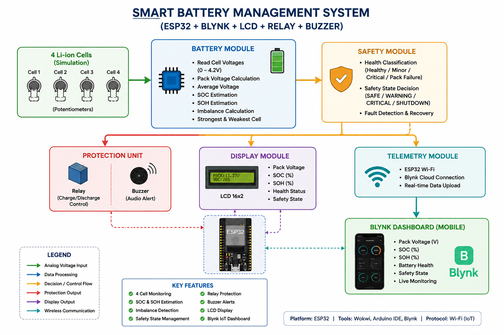
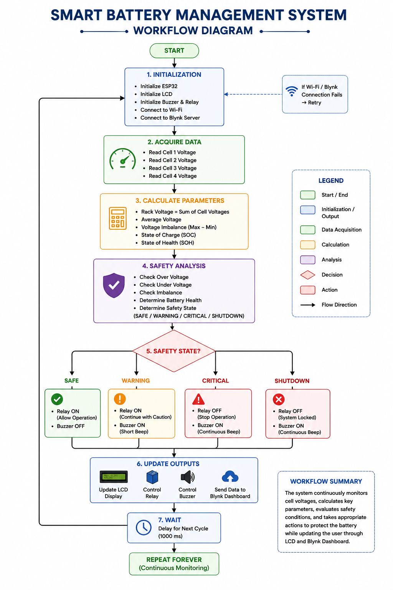
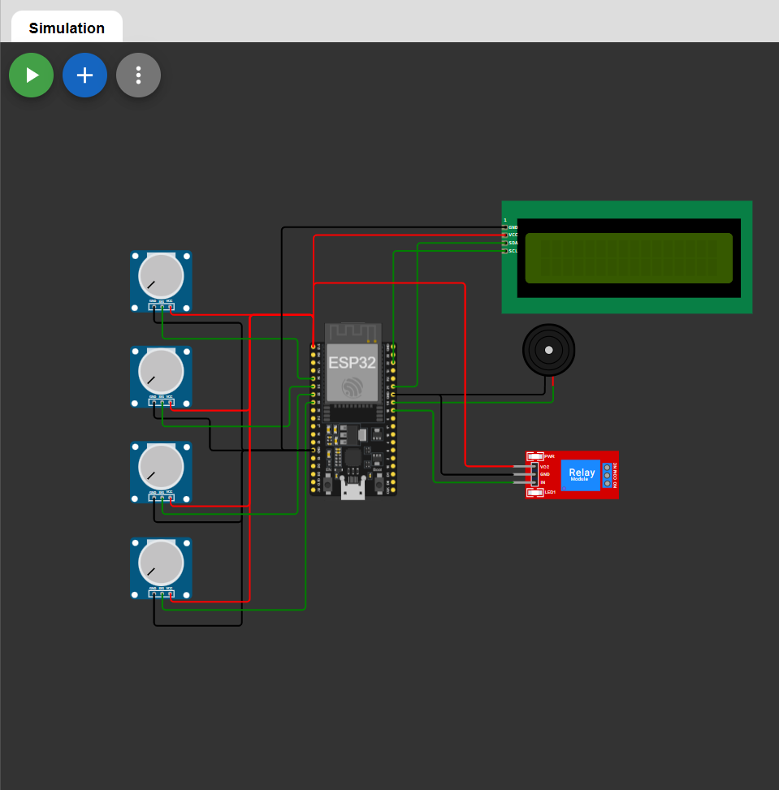
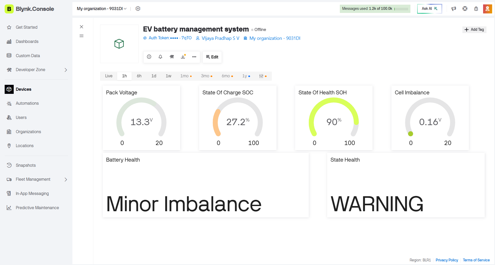

# 🔋 EV Battery Management System (BMS)

An ESP32-based Battery Management System (BMS) developed as part of the **Elevance Skills Virtual Internship**. The project monitors four simulated Li-ion cells, calculates battery parameters, detects faults, displays information on an LCD, controls protection hardware, and uploads real-time data to the Blynk IoT dashboard.

---

## 📌 Project Overview

This project simulates a Battery Management System using **ESP32**, **Wokwi**, and **Blynk**. Four potentiometers emulate individual cell voltages. The ESP32 continuously measures these voltages, calculates battery parameters, evaluates battery health, and performs protection using a relay and buzzer while displaying live information on an LCD and Blynk dashboard.

---

## ✨ Features

- 🔋 4-Cell Battery Monitoring
- 📊 Pack Voltage Calculation
- ⚡ State of Charge (SOC)
- ❤️ State of Health (SOH)
- ⚖️ Cell Imbalance Detection
- 🛡️ Battery Safety Monitoring
- 🔔 Relay & Buzzer Protection
- 📟 LCD Status Display
- ☁️ Blynk IoT Dashboard
- 📈 Real-Time Monitoring

---

## 🛠 Hardware Components

- ESP32 DevKit V1
- 4 × Potentiometers (Cell Simulation)
- 16x2 I2C LCD
- Relay Module
- Buzzer

---

## 💻 Software & Tools

- PlatformIO
- Arduino Framework
- Wokwi Simulator
- Blynk IoT
- Git & GitHub

---

# 🏗 System Architecture



---

# 🔄 Workflow Diagram



---

# 🔌 Wokwi Circuit



### Wokwi Project

https://wokwi.com/projects/470593607453782017

---

# 📊 Blynk Dashboard



The dashboard provides:

- Pack Voltage
- State of Charge (SOC)
- State of Health (SOH)
- Cell Imbalance
- Battery Health
- Safety State

---

# 📂 Project Structure

```
EV-Battery-Management-System
│
├── src/
├── lib/
├── include/
├── docs/
│   ├── Architecture_Diagram.png
│   ├── Workflow_Diagram.png
│   └── BMS_Internship_Report.pdf
├── images/
│   ├── Dashboard.png
│   └── Wokwi_Circuit.png
├── diagram.json
├── wokwi.toml
├── platformio.ini
└── README.md
```

---

# 🚀 Getting Started

1. Clone the repository

```bash
git clone https://github.com/vj-spec/EV-Battery-Management-System.git
```

2. Open the project in PlatformIO.

3. Build and upload the firmware to the ESP32.

4. Configure your Blynk credentials in the configuration file.

5. Monitor the battery status on the LCD and Blynk Dashboard.

---

# 📄 Internship Report

The complete internship report is available here:

📄 **docs/BMS_Internship_Report.pdf**

---

# 👨‍💻 Author

**Vijaya Pradhap S V**

Electronics and Communication Engineering

ESP32 • Embedded Systems • IoT • Battery Management Systems

---

## 📜 License

This project was developed for academic and internship purposes.
